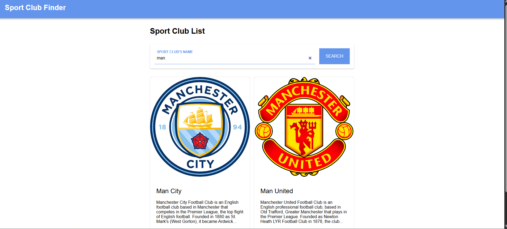
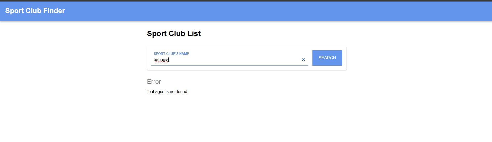

# Sport Club Finder ⚽

A web application for finding sports clubs information built with Vanilla JavaScript, Web Components, and Sports API. This project implements modern frontend development patterns with modular architecture using Webpack.
## 📸 Application Screenshots

## 🏠 Main Dashboard

Clean interface showing club search functionality with floating search bar and club cards.

## ⚠️ Error State

Error display when no clubs are found or API request fails.

📁 Project Structure
--

sport-club-finder/

├── src/
│   ├── app.js                    # Main application entry point

│   ├── styles/
│   │   └── style.css            # Global styles

│   ├── public/

│   │   └── favicon.png          # Application icon

│   └── script/

│       ├── components/          # Web Components

│       │   ├── app-bar.js

│       │   ├── club-item.js

│       │   ├── club-list.js

│       │   ├── club-search-error.js

│       │   ├── footer-bar.js

│       │   ├── index.js

│       │   └── search-bar.js

│       ├── data/

│       │   ├── local/           # Local data handling

│       │   ├── remote/          # Remote API calls

│       │   └── utils.js         # Utility functions

│       └── view/
│           └── home.js          # Main view logic

├── screenshot/                   # Application screenshots

│   ├── dashboard.png

│   └── error.png

├── webpack.common.js            # Webpack common configuration

├── webpack.dev.js               # Webpack development configuration

├── webpack.prod.js              # Webpack production configuration

├── index.html                   # HTML template

├── package.json                 # Dependencies & scripts

└── README.md

## 🛠️ Technologies Used

    Vanilla JavaScript (ES6+)

    Web Components – Custom Elements with Shadow DOM

    Webpack – Module bundler with development/production configurations

    CSS3 – Modern styling with flexbox, grid, and animations

    Fetch API – For RESTful communication

    Babel – JavaScript transpiler for browser compatibility

    Sports API – External API for club data

## 🔧 API Integration

The application uses Sports API to fetch club data:
API Endpoint
javascript

GET https://sports-api.dicoding.dev/teams/search?t={query}

Response Format
json

{
  "teams": [
    {
      "idTeam": "133604",
      "strTeam": "Manchester City",
      "strTeamBadge": "https://www.thesportsdb.com/images/media/team/badge/xxyyzz.png",
      "strDescriptionEN": "Club description..."
    }
  ]
}

API Service (sports.api.js)
javascript

class SportsApi {
  static searchClub(query) {
    return fetch(`${BASE_URL}/teams/search?t=${query}`)
      .then(response => response.json())
      .then(responseJson => {
        const { teams: clubs } = responseJson;
        if (clubs.length > 0) {
          return Promise.resolve(clubs);
        } else {
          return Promise.reject(new Error(`\`${query}\` is not found`));
        }
      });
  }
}

## 🧩 Web Components Architecture
1. <app-bar>

    Application header with brand name

    Uses Shadow DOM for encapsulation

    Sticky positioning

2. <search-bar>

    Floating search form with animated labels

    Form validation and submission handling

    Custom events for search functionality

3. <club-list>

    Configurable grid layout (columns, gutter)

    Responsive club card container

    Dynamic slot content

4. <club-item>

    Individual club card display

    Team badge image, name, and description

    Ellipsis for long descriptions

5. <club-search-error>

    Error state display

    Custom slot for error messages

    Clean error UI

6. <footer-bar>

    Application footer

    Copyright information

    Consistent styling with header

## 🚀 How to Run
Installation
bash

npm install

Development Mode
bash

npm run start-dev

The application will run at http://localhost:8080 with hot reload enabled.
Production Build
bash

npm run build
 
Build files will be generated in the dist/ folder.

## 📦 NPM Scripts
json

"scripts": {
  "start-dev": "webpack serve --config webpack.dev.js",
  "build": "webpack --config webpack.prod.js"
}

## ⚙️ Webpack Configuration
Development (webpack.dev.js)

    Inline source maps for debugging

    Development server with hot reload

    File watching for automatic rebuilds

    Error overlay in browser

Production (webpack.prod.js)

    Minified code for performance

    Babel transpilation for browser compatibility

    Optimized bundle size

    No source maps for security

## 🎨 UI/UX Features

    Responsive Design – Adapts to mobile, tablet, and desktop

    Floating Search Bar – Sticky search form for easy access

    Animated Form Labels – Labels transform into placeholders

    Club Card Grid – Responsive grid layout for club display

    Error States – User-friendly error messages

    Smooth Transitions – CSS transitions for interactive elements

## 🔐 Security & Best Practices

    Shadow DOM – Component encapsulation and style isolation

    Input Validation – Form validation before API calls

    Error Handling – Graceful error states and user feedback

    Code Splitting – Modular component architecture

    Performance – Optimized images and bundle size

## 🧪 Features & Functionality
Search Functionality

    Real-time club searching by name

    API integration with error handling

    Empty state and loading indicators

## Club Display

    Team badges and logos

    Club descriptions with text truncation

    Responsive card layout

User Experience

    Instant feedback on actions

    Clear error messages

    Intuitive navigation

🔮 Future Enhancements

    Club Details Page – More detailed information about each club

    Favorites System – Bookmark favorite clubs

    Filtering – Filter by sport type, country, or league

    Pagination – Load more clubs with infinite scroll

    Dark Mode – Theme toggle for better accessibility

    Offline Support – Service worker for offline functionality

    Performance Metrics – Loading time optimizations

📝 Development Notes
Architecture Patterns

    Component-Based – Reusable Web Components

    Separation of Concerns – Clear division between UI, logic, and data

    Event-Driven – Custom events for component communication

    Modular Design – Independent, testable components

Code Quality

    ES6+ Features – Modern JavaScript syntax

    CSS Variables – Consistent design tokens

    BEM-like Naming – Scalable CSS architecture

    Code Comments – Comprehensive documentation

🐛 Troubleshooting
Common Issues

    API not responding – Check internet connection and CORS settings

    Components not rendering – Verify Web Components are properly registered

    Styles not applying – Check Shadow DOM encapsulation

    Build errors – Ensure all dependencies are installed

Development Tips

    Use browser DevTools to inspect Web Components

    Check network tab for API requests

    Monitor console for JavaScript errors

    Test responsive design with device toolbar

## 📄 License

This project is created for educational purposes as part of the Belajar Fundamental Front-End Developer course. Sports data provided by TheSportsDB API.

## 🎯 Project Status: ✅ Fully Functional
## 📚 Course: Belajar Fundamental Front-End Developer
## 👨‍💻 Author: Rangga utama
## 🔗 Repository: [GitHub Link Here](https://github.com/ranggautama47/Notes-App)